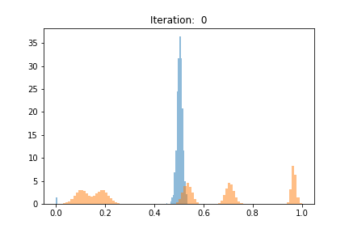
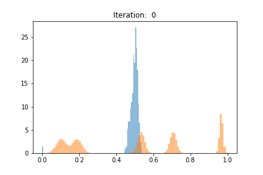

# Multi Agent Diverse Generative Adversarial Network (MAD-GAN)

Pytorch Code for MAD-GAN.

#### Requirements

* pytorch >=0.4.0
* torchvision ==0.2.0
* Jupyter Notebook

#### Datset 
* A distribution of 1D GMM having five mixture components with modes at 10, 20, 60, 80 and 110, and standard
deviations of 3, 3, 2, 2 and 1, respectively.

#### Usage
* Run the Simple_GANs.ipynb to generate the results for vanilla GAN.
* For MAD-GAN run the Mad_GANs.ipynb to compare the results of vanillaGAN over MAD-GAN.
* Number of generater of MAD-GAN can by changing 'num_gen' and G.params(). 

#### Results

                 [Left]: Result of VanillaGAN                [Right]: Result of MAD-GAN (number of generator = 4)

### Resources

* [Multi-Agent Diverse Generative Adversarial Networks](https://www.youtube.com/watch?v=DP4j2w-x7KI)

* [Ghosh, Arnab, et al. "Multi-agent diverse generative adversarial networks." Proceedings of the IEEE Conference on Computer Vision and Pattern Recognition. 2018.](http://openaccess.thecvf.com/content_cvpr_2018/papers/Ghosh_Multi-Agent_Diverse_Generative_CVPR_2018_paper.pdf)

### Acknowledgements
* https://github.com/wiseodd
* Ghosh, Arnab, et al. "Multi-agent diverse generative adversarial networks." Proceedings of the IEEE Conference on Computer Vision and Pattern Recognition. 2018
